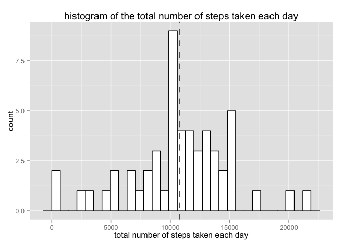
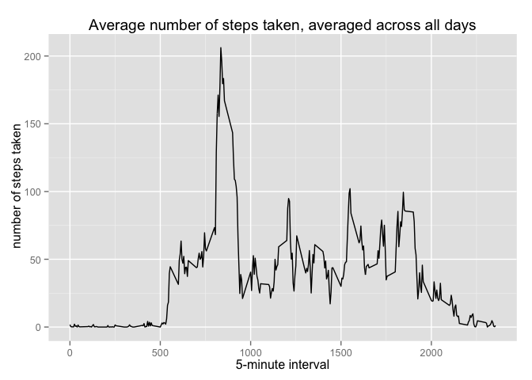
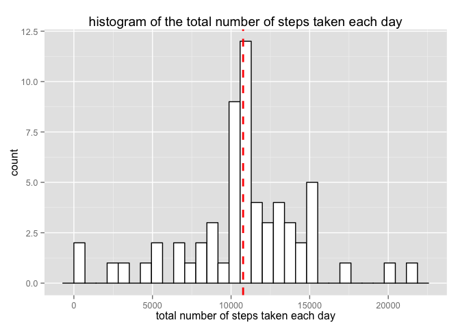
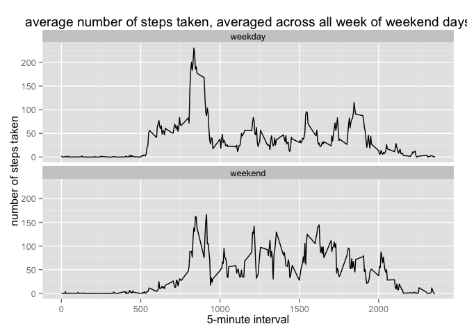

# Reproducible Research: Peer Assessment 1
Karunesh Arora  
June 11, 2015  
## Introduction
This assignment makes use of data from a personal activity monitoring device. This device collects data at 5 minute intervals through out the day. The data consists of two months of data from an anonymous individual collected during the months of October and November, 2012 and include the number of steps taken in 5 minute intervals each day.

## Loading and preprocessing the data


```r
#load required packages
suppressWarnings(library(ggplot2));suppressWarnings(library(magrittr));suppressWarnings(library(lubridate));suppressMessages(library(dplyr))

#read the csv format dataset from the current working directory
df<-read.table(unz("activity.zip", "activity.csv"), header=T, quote="\"", sep=",")
# convert date variable to date format
df$date<-ymd(df$date)
#check the number of variables and observations in the dataset 
str(df)
```

```
## 'data.frame':	17568 obs. of  3 variables:
##  $ steps   : int  NA NA NA NA NA NA NA NA NA NA ...
##  $ date    : POSIXct, format: "2012-10-01" "2012-10-01" ...
##  $ interval: int  0 5 10 15 20 25 30 35 40 45 ...
```
## What is mean total number of steps taken per day?
Here, we report the total number of steps taken per day, the mean and median total number of steps taken per day. In this part of the assingment we ignore the missing values (NAs) in the dataset.


```r
#Calculate the total number of steps taken per day. Store output in "daily_total" variable
daily_total<-df%>% select(steps,date)%>%
  group_by(date)%>%
  summarise(tot_steps=sum(steps))

##ignore the missing values in the dataset here
##round the numbers to 2 decimal place
daily_total<-daily_total[!is.na(daily_total$tot_steps),2]
```


```r
##histogram of the total number of steps taken each day
##red line added for the mean
ggplot(daily_total, aes(tot_steps)) +
geom_histogram(colour="black", fill="white") +
geom_vline(aes(xintercept=(mean(daily_total$tot_steps))), color="red", linetype="dashed",size=1)+
xlab("total number of steps taken each day")+ 
ggtitle("histogram of the total number of steps taken each day")
```

 


```r
##mean of the total number of steps taken per day
mean_steps<-mean(daily_total$tot_steps)
mean_steps
```

```
## [1] 10766.19
```

```r
##median of the total number of steps taken per day
median_steps<-median(daily_total$tot_steps)
median_steps
```

```
## [1] 10765
```

## What is the average daily activity pattern?

```r
##group_by "interval" and compute mean of steps 
#store output in the new dataframe "newdf"
newdf<-df%>%select(steps,interval)%>%
  group_by(interval)%>%
  summarize(mean_steps = mean(steps, na.rm = TRUE))
```


```r
#Average number of steps taken, averaged across all days
ggplot(newdf,aes(interval,mean_steps))+geom_line() + 
xlab("5-minute interval")+
ylab(" number of steps taken")+
ggtitle("Average number of steps taken, averaged across all days")
```

 


```r
##Which 5-minute interval, on average across all the days in the dataset, contains the maximum number of steps?
#interval 835 has max mean steps
newdf%>%filter(mean_steps==max(mean_steps))
```

```
## Source: local data frame [1 x 2]
## 
##   interval mean_steps
## 1      835   206.1698
```

## Imputing missing values
Fill in all of the missing values in the dataset using the mean steps for that 5-minute interval
create new dataset that is equal to the original dataset but with the missing data filled in.

```r
##Total number of missing values in the dataset ((i.e. the total number of rows with NAs))
nrow(df[is.na(df$steps),])
```

```
## [1] 2304
```


```r
#copy original dataset ("df")  to new data frame ("df_copy")
df_copy<-df

#fill NA's in df_copy with mean steps for that 5-minute interval stored in "mean_steps"
tmp<-rep(newdf$mean_steps,8)
df_copy[is.na(df_copy$steps),]$steps<-tmp
#convert date variable to date format
df_copy$date<-as.Date(df_copy$date)

#Create a new factor variable in the dataset with two 
#levels – “weekday” and “weekend” indicating whether
#a given date is a weekday or weekend day.
df_copy<-df_copy%>%mutate(dayOfWeek=wday(date,label = TRUE, abbr = TRUE))
df_copy%<>%mutate(dayOfWeek=ifelse(dayOfWeek=="Sat" | dayOfWeek=="Sun","weekend","weekday"))
df_copy$dayOfWeek<-as.factor(df_copy$dayOfWeek)
#new dataset "df_copy" with filled NA values
#from here on we use this dataset to answer questions below
str(df_copy)
```

```
## 'data.frame':	17568 obs. of  4 variables:
##  $ steps    : num  1.717 0.3396 0.1321 0.1509 0.0755 ...
##  $ date     : Date, format: "2012-10-01" "2012-10-01" ...
##  $ interval : int  0 5 10 15 20 25 30 35 40 45 ...
##  $ dayOfWeek: Factor w/ 2 levels "weekday","weekend": 1 1 1 1 1 1 1 1 1 1 ...
```

Here, again we compute the total number of steps, mean and the median of steps taken per day but
now with the dataset with filled missing values.

```r
#compute the total number of steps taken per day
daily_steps_df<-df_copy%>% select(steps,date)%>%
  group_by(date)%>%
  summarise(tot_steps=sum(steps))
```


```r
##histogram of the total number of steps taken each day
##red line added for the mean
ggplot(daily_steps_df, aes(tot_steps)) +
geom_histogram(colour="black", fill="white") +
geom_vline(aes(xintercept=(mean(daily_steps_df$tot_steps))), color="red", linetype="dashed",size=1)+
xlab("total number of steps taken each day")+ 
ggtitle("histogram of the total number of steps taken each day")
```

 

Clearly, imputed data shows an increase in the frequency of steps around the mean value of steps. This is because we filled in the missing values with the mean total number of steps.

```r
#mean of steps taken
mean(daily_steps_df$tot_steps)
```

```
## [1] 10766.19
```

```r
#median of steps taken
median(daily_steps_df$tot_steps)
```

```
## [1] 10766.19
```

```r
#difference in the median value before and after the imputation 
# difference=median before imputation - median after imputation
difference<-(median_steps - median(daily_steps_df$tot_steps))
difference
```

```
## [1] -1.188679
```
Our results show that after filling in the missing values (NAs) in the original dataset the 
mean total number of steps taken per day remains unchanged but the median value changes
slightly.

## Are there differences in activity patterns between weekdays and weekends?

```r
#panel plot
df2<-df_copy%>% select(steps,dayOfWeek,interval,date)%>%
  group_by(dayOfWeek,interval)%>%
  summarise(steps=mean(steps))

ggplot(df2,aes(interval,steps))+geom_line()+
  facet_wrap(~dayOfWeek,ncol=1)+
  xlab("5-minute interval")+
  ylab("number of steps taken")+
  ggtitle("average number of steps taken, averaged across all week of weekend days")
```

 
Results show that the individual is much more active throughout the day on weekends compared to the weekdays. Interestingly, individual is much more active early in the day on weekday compared to the weekend (values below 1000 in the figure above).

